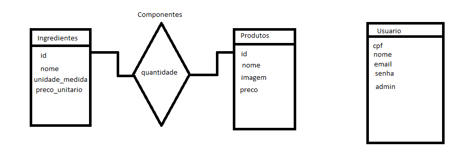

# Escopo do problema a ser solucionado

Um cliente chegou na loja e comprou 5 cookies. O barista olhou o pedido e ficou desesperado, havia somente 2 cookies na loja.
Ele teve que explicar ao cliente o ocorrido e o cliente foi embora, essa situação não aconteceria se o pessoal do TI estivesse controlado o estoque.

Sobre:

Você foi designado a resolver esse problema e precisa estruturar todo sistema de estoque e produtos para evitar acontecer novamente.

Requisitos:

O estoque nada mais é que controlar quantos ingredientes tem na loja, além de cookie em uma cafeteria tem outros ingredientes como café em pó, leite, entre outros.
Para organizar melhor crie uma estrutura de ingrediente com nome, unidade de medida e preço unitario.

Antes de ter um estoque você precisa ter um produto com algumas coisas basicas que o cliente precisa saber como: nome, imagem, preço e os ingredientes que esse produto tem. 
Porém temos um problema aqui, o ingrediente é só uma referencia a o que foi usado ele não tem quantidade, então você precisa fazer um novo objeto que faça referência a esse ingrediente com a quantidade que é usado, nós chamamos de componente.

Agora você já tem as informações basicas para controlar o estoque, organize em um objeto para que o cliente consiga visualizar os ingredientes da loja e quanto tem de estoque atualmente.

Ufa, tudo pronto, mas ainda o problema não foi resolvido, você só esta controlando quanto tem, faça uma rota de verificação para saber se o produto X pode ser vendido. 

Como você não tem acesso ao PDV faça uma rota de controle manual para o dono da loja imputar os valores do estoque.

O dono é quem cadastra todas as informações da loja, inclusive o upload da imagem, então será necessario uma rota para CRUD dessas informações.
Além disso alterar as informações é restrito então essas rotas especificas precisa de um login para controlar.

Situação resolvida, agora o cliente pediu novas alterações, como sempre. Ele precisa de um relatório para saber o custo dos produtos, você tem essas informações de quanto custa o ingrediente e de quanto vai no produto.
Precisamos de uma rota que retorne todos os produtos e o custo de cada um.

Observações técnicas:
- Validar todos os campos para ninguem quebrar a loja
- Login precisa ser criptografado a senha
- Documentar para entendimento do código. (comentar algumas coisas explicando)
- Tratar erros corretamente (404 para não encontrado), (200 | 202 para OK), etc

Requisitos:
- Utilizar Spring Boot e Hibernate
- Validar as rotas utilizando JWT ou Oauth2
- Salvar em um banco de dados as informações

Diferenciais:
- Upload de imagens (deixar somente PNG e JPG)

Lembrando que os diferenciais são algo a mais, então só faça caso ja tenha conhecimento e esteja familiarizado.

# O que consegui solucionar
- Ele lista, cria, atualiza e deleta todos os produtos e seus ingredientes como solicitado pelo desafio.
- Quando o usuário é inserido no banco de dados, sua senha é criptografada.
- O upload de imagem é feito usando o URL da imagem.
- O esquema do banco de dados é esse:

- O URL para que sejam feitas as requisições ao API é: localhost:8080/api/v1/produtos